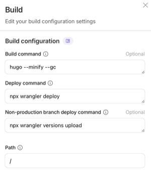

# Infinite Improbability Drive — Blog

Official blog for Infinite Improbability Drive, where we publish updates, announcements, and project progress.

## Website

- **Main site**: `https://infinitedrive.xyz`
- **Blog (this repository)**: `https://blog.infinitedrive.xyz`

## Tech stack

- **Static site generator**: [Hugo](https://gohugo.io/)
- **Theme**: [hugo-brewm](https://github.com/foxihd/hugo-brewm) (tracked as a Git submodule under `themes/hugo-brewm`)

## Requirements

- **Hugo**: v0.135.0 or later
- **Git**: for cloning and managing the theme submodule
- **Node.js (optional)**: only if you enable Pagefind indexing

## Clone (with submodules)

This repository uses a Git submodule for the theme. The easiest way to clone is:

```bash
git clone --recurse-submodules https://github.com/deep-thought-labs/drive-blog
cd drive-blog
```

If you already cloned the repo without submodules:

```bash
git submodule update --init --recursive
```

## Local development

Run the Hugo development server:

```bash
hugo server --minify
```

The site will be available at `http://localhost:1313`.

### Local development (with Pagefind search)

`hugo server` does **not** generate the Pagefind index automatically. If you have Pagefind enabled (`params.search.pagefind = true` in `hugo.toml`), you have two options:

#### Option A (recommended): build + index + serve `public/`

This matches production most closely:

```bash
hugo --minify --gc && npx --yes pagefind --site public
```

Then serve the generated `public/` directory with any static file server, for example:

```bash
python3 -m http.server --directory public 1313
```

#### Option B: Hugo Server + separate terminal for Pagefind

If you want to keep using `hugo server` locally, run Hugo in one terminal and regenerate the Pagefind index in another terminal.

Terminal A (Hugo):

```bash
hugo server --minify --renderToDisk
```

Terminal B (Pagefind, rerun whenever content changes):

```bash
npx --yes pagefind --site public
```

## Production build

Generate the static site into `public/`:

```bash
hugo --minify
```

### (Optional) Pagefind search index

If your configuration enables Pagefind search (see `params.search.pagefind` in `hugo.toml`), build the search index after generating `public/`:

```bash
npx pagefind --site "public"
```

### Cloudflare (Wrangler) build settings

Cloudflare is used here to host the built site and (optionally) connect it to a **custom domain** with **automatic builds / deployments** when changes are pushed to this repository.

This is **already configured for our official domain**. The details below are shared for **informational and educational** purposes.

#### Base configuration

These are the baseline settings we use:

> **Important:** Make sure the Cloudflare project/Worker name matches the `name` field in `wrangler.json` (currently `drive-blog`), otherwise deployments may target the wrong project or fail.

```text
# Build configuration

Build command:hugo --minify --gc
Deploy command:npx wrangler deploy
Version command:npx wrangler versions upload
Root directory:/
```

Click to enlarge:

[](assets/images/cloudflare-configuration.png)


#### Optional: Pagefind support

This project has Pagefind enabled (`params.search.pagefind = true`). To make the built-in search UI work, your build must also generate the `public/pagefind/` index (same config as above, but with an extended build command):

```text
# Build configuration (with Pagefind)

Build command:hugo --minify --gc && npx --yes pagefind --site public
Deploy command:npx wrangler deploy
Version command:npx wrangler versions upload
Root directory:/
```

## Updating the theme submodule

To pull the latest changes from the theme repository:

```bash
git submodule update --remote --merge themes/hugo-brewm
```

Then commit the updated submodule pointer:

```bash
git add themes/hugo-brewm
git commit -m "Update hugo-brewm theme"
```

## Content structure

- **Posts**: `content/<lang>/posts/` (e.g. `content/en/posts/`)
- **Home pages**: `content/<lang>/_index.md`
- **Site config**: `hugo.toml`
